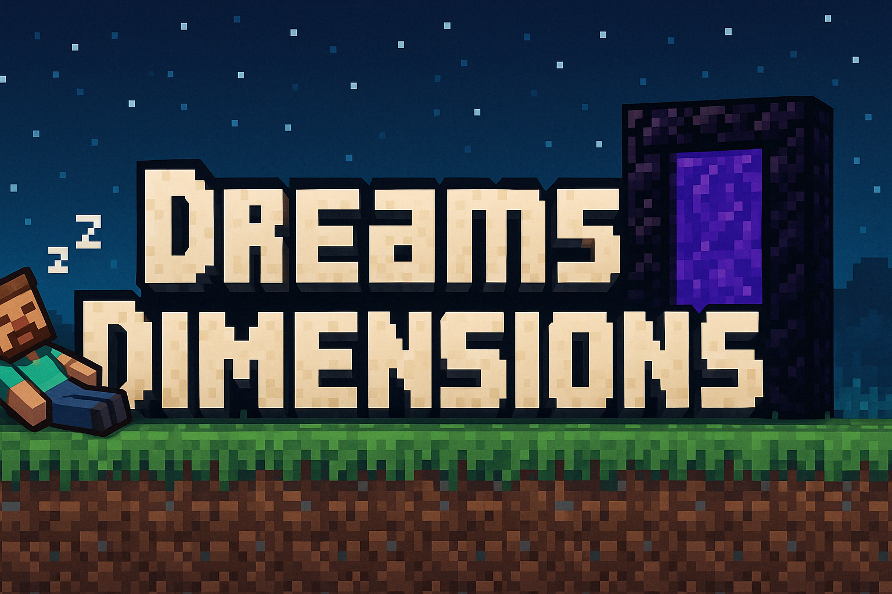

# 🌌 DreamsDimensions

**Dreams Dimensions** é um mod em desenvolvimento para Minecraft 1.21.4+ criado com NeoForge que adiciona uma nova dimensão mística acessível através dos sonhos. Ao dormir no Overworld, os jogadores podem ser transportados para a **Dimensão Pacífica**, um mundo sereno repleto de blocos únicos, minérios raros e uma atmosfera encantadora.

---

## ✨ Destaques

- 🛏️ **Mecânica de Teleporte ao Dormir**  
  Dormir no Overworld pode transportar você para a dimensão dos sonhos.

- 🌿 **Blocos Inéditos**
    - Grama Onírica
    - Pedra Serena
    - Tronco e Folhas de Árvore dos Sonhos
    - Flor dos Sonhos

- 💎 **Minério dos Sonhos**  
  Um recurso raro com potencial para crafting avançado.

- 💨 **Pó de Sonho**  
  Item de progressão para futuras mecânicas mágicas.

- ⏰ **Despertador Onírico**  
  Item usado para retornar ao mundo real.

- 🌍 **World Generation Personalizada**  
  Ilhas flutuantes e paisagens únicas criam uma atmosfera de outro mundo.

---

## 🚀 Instalação

1. Certifique-se de estar usando o **Minecraft 1.21.4** com **NeoForge 21.4.124+**.
2. Baixe a versão mais recente do mod na aba [Releases](https://github.com/SeuUsuario/DreamsDimensions/releases).
3. Coloque o arquivo `.jar` na pasta `mods` do seu diretório `.minecraft`.
4. Inicie o jogo e aproveite a viagem!

---

## 🛠️ Desenvolvimento

Este mod está sendo desenvolvido em C++/Java com a biblioteca NeoForge e um sistema modular de fases:

- ✅ Fase 1: Blocos e Itens
- 🔄 Fase 2: Assets e Data Generation
- 🔄 Fase 3: Criação da Dimensão
- 🔄 Fase 4: Lógica de Teleporte e Retorno
- 🔄 Fase 5: Geração de Minérios e Testes Finais

---

## 📸 Galeria

*Imagens e gifs em breve!*

---

## 🤝 Contribuindo

Sinta-se à vontade para abrir issues, sugerir ideias ou fazer pull requests!  
Todas as contribuições são bem-vindas 💜

---

## 📄 Licença

Distribuído sob a [MIT License](LICENSE).

---

> _"Sonhar é viajar sem sair da cama. E agora, com Dreams Dimensions, é também explorar um novo mundo."_ 🌙
