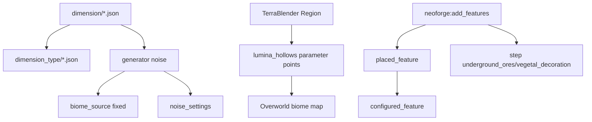

# Dimensões e Worldgen

## Sumário
- [Dimensões registradas](#dimensões-registradas)
- [Dimension types](#dimension-types)
- [Biomas](#biomas)
- [Worldgen de features](#worldgen-de-features)
- [Pipeline Mermaid](#pipeline-mermaid)
- [Onde achar recursos-chave](#onde-achar-recursos-chave)

## Dimensões registradas
| Dimensão | Arquivo | Type |
|---|---|---|
| `dreamsdimensions:dreamscape` | `data/dreamsdimensions/dimension/dreamscape.json` | `dreamsdimensions:dreamscape_type` |
| `dreamsdimensions:campo_onirico_azul` | `data/dreamsdimensions/dimension/campo_onirico_azul.json` | `dreamsdimensions:campo_onirico_azul_type` |

## Dimension types
| Type | ambient_light | skylight | fixed_time | natural | bed_works | respawn_anchor_works |
|---|---:|---|---:|---|---|---|
| `dreamsdimensions:dreamscape_type` | 1.0 | true | NÃO DEFINIDO | false | true | false |
| `dreamsdimensions:campo_onirico_azul_type` | 1.0 | true | 6000 | true | true | false |

## Biomas
| Bioma | Origem | Observações |
|---|---|---|
| `dreamsdimensions:dreamscape_biome` | `worldgen/biome/dreamscape_biome.json` | sem spawns configurados. |
| `dreamsdimensions:campo_onirico_azul` | `worldgen/biome/campo_onirico_azul.json` | spawns de hostis/passivos e sem precipitação. |
| `dreamsdimensions:lumina_hollows` | `worldgen/biome/lumina_hollows.json` | bioma Overworld injetado via TerraBlender. |

## Worldgen de features
### Minério no Overworld
Arquivo:
- `data/dreamsdimensions/worldgen/biome_modifier/dream_ore_overworld.json`

Config:
- `type = neoforge:add_features`
- `biomes = #minecraft:is_overworld`
- `features = dreamsdimensions:ow_dream_ore, dreamsdimensions:ow_deepslate_dream_ore`
- `step = underground_ores`

### Flora/Trees no lumina_hollows
Arquivos:
- `data/dreamsdimensions/neoforge/biome_modifier/add_lumina_hollows_lumina_flower.json`
- `data/dreamsdimensions/neoforge/biome_modifier/add_lumina_hollows_somniflora.json`
- `data/dreamsdimensions/neoforge/biome_modifier/add_somnibark_tree_to_lumina_hollows.json`

**NÃO há estruturas customizadas** (`worldgen/structure` ausente no mod).

## Pipeline Mermaid

## Onde achar recursos-chave
- Minérios OW: `worldgen/configured_feature/ow_dream_ore.json`, `.../ow_deepslate_dream_ore.json`
- Árvores/flora OW: `worldgen/configured_feature/ow_somnibark_tree.json`, `patch_ow_lumina_flower.json`, `patch_ow_somniflora.json`
- Noise sonho: `worldgen/noise_settings/dreamscape_noise.json`, `campo_onirico_azul_noise.json`
