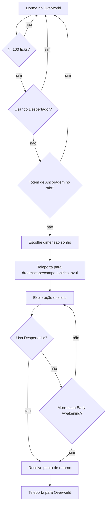

# Loop de Gameplay

## Sumário
- [Loop principal](#loop-principal)
- [Checklist de teleporte por sono](#checklist-de-teleporte-por-sono)
- [Escolha de dimensão](#escolha-de-dimensão)
- [Retorno ao Overworld](#retorno-ao-overworld)
- [Prioridade de ponto de retorno](#prioridade-de-ponto-de-retorno)
- [Limitações](#limitações)
- [Fluxograma Mermaid](#fluxograma-mermaid)

## Loop principal
Fluxo macro:
1. Jogador dorme no **Overworld**.
2. Handler de sono valida condições e teleporta para dimensão de sonho.
3. Jogador coleta recursos (`ow_dream_dust`, cadeia OW).
4. Retorno via **Despertador Onírico** (`dreamsdimensions:ow_oneiric_awakener`) ou via efeito de **Despertar Prematuro** em morte.

## Checklist de teleporte por sono
Teleporte só dispara quando **todas** as condições passam:
- `ServerPlayer` válido.
- dimensão atual = `minecraft:overworld`.
- jogador está dormindo.
- `isSleepingLongEnough()` (>= 100 ticks).
- não está usando `dreamsdimensions:ow_oneiric_awakener`.
- não há `dreamsdimensions:ow_anchoring_totem` no raio configurado.
- UUID ainda não teleportado no ciclo de sono.

## Escolha de dimensão
Fonte: `SleepTeleportHandler.pickDreamDimension` + `DreamsConfig`.
- Candidatas = `dream_dimensions` existentes no servidor.
- Se lista vazia: fallback para `dreamsdimensions:dreamscape`.
- Se >1 dimensão: evita repetir a última (`last_dream_dimension`) quando possível.
- RNG: `server.overworld().getRandom()`.

## Retorno ao Overworld
### Item Despertador Onírico
- `use`: só inicia uso em dimensão marcada como sonho e sem cooldown.
- `finishUsingItem`: chama `DreamReturnHelper.buildReturnTransition`.
- Cooldown: `60 ticks`.

### Early awakening (efeito)
Com `dreamsdimensions:ow_early_awakening`, morte em dimensão de sonho:
- cancela morte,
- remove efeito,
- seta vida para 25% (mín. 1 HP),
- teleporta para retorno calculado.

## Prioridade de ponto de retorno
`DreamReturnHelper.resolveTarget`:
1. **Stand-up da cama salva** no Overworld (`dream_return`).
2. **Respawn vanilla** (`findRespawnPositionAndUseSpawnBlock`).
3. **Spawn global** (`RespawnData.pos`) com busca de local seguro.

## Limitações
- Sem comando dedicado de teleporte/retorno.
- Sem UI própria de seleção de dimensão.
- Bloqueio por totem depende de varredura cúbica por raio.

## Fluxograma Mermaid

