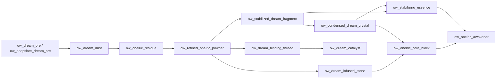

# Progressão

## Sumário
- [Early game](#early-game)
- [Mid game](#mid-game)
- [Late game](#late-game)
- [Mapa de dependências](#mapa-de-dependências)
- [Rotas alternativas](#rotas-alternativas)

## Early game
Objetivo:
- obter `dreamsdimensions:ow_dream_dust` via minério OW,
- converter em `ow_oneiric_residue`,
- começar refino (`ow_refined_oneiric_powder`).

Risco/controle:
- se quiser pausar incursões oníricas, usar `dreamsdimensions:ow_anchoring_totem` próximo da cama.

## Mid game
- produção de `ow_stabilized_dream_fragment`.
- condensação em `ow_condensed_dream_crystal`.
- craft de materiais de suporte de poções (`ow_dream_binding_thread`, `ow_dream_catalyst`).

## Late game
- `ow_dream_infused_stone`.
- `ow_oneiric_core_block`.
- `ow_stabilizing_essence`.
- item final: `ow_oneiric_awakener`.

## Mapa de dependências

## Rotas alternativas
- **Rápida (tempo):** priorizar blasting para reduzir tempo de refino de `ow_oneiric_residue`.
- **Econômica (combustível):** smelting padrão com melhor gestão de fornalha.
- **Controle de risco:** craftar `ow_anchoring_totem` cedo para impedir teleporte involuntário durante preparação.
- **Foco em poções:** desviar parte do `ow_refined_oneiric_powder` para cadeia de brewing antes do Despertador.
